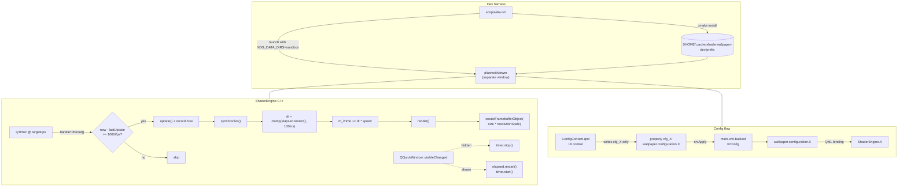

# Phase 1 — Dev Harness + Critical Bugs

**Status:** approved
**Date:** 2026-05-25
**Project:** kde-shader-wallpaper-4 (v4.0 C++ port)

## Problem

Two pain points, addressed together because the dev harness unblocks verification of the bug fixes:

1. **Iterating on the wallpaper requires killing/restarting `plasmashell`.** Every code change → `./scripts/build.sh install` → `pkill plasmashell && plasmashell &`. Multi-second feedback loop, plus the developer's real desktop session restarts every time, which loses window layouts and panel state.
2. **A cluster of legacy issues makes the plugin partially unusable for end users.** From the legacy QML repo (https://github.com/y4my4my4m/kde-shader-wallpaper/issues), the most-reported problems are: "Apply button stays disabled / shader doesn't change after first selection" (#98, #88, #78, #79); texture not loaded on cold boot until UI is touched (#73); shader stops animating after ~30 min of idle / on lockscreen (#106); high-refresh monitors get visual speed-ups when the desktop is interacted with (#43); no working FPS limiter, no resolution downscale (#80, #85, #23).

## Out of scope (deferred to Phase 2+)

All feature requests. Specifically deferred:

- Randomize / playlist / time-of-day profiles (#96, #31, #94)
- Visual previews in shader picker, beyond what already exists (#62)
- Hue/contrast/blur post-fx (#75, #49)
- 16-bit FBO to fight banding (#76)
- iScreenOffset / iScreenIndex / multi-monitor span (#108, #6)
- Per-virtual-desktop shader or uniform, parallax (#74, #47)
- Auto-detect `iCh0`-style texture files next to a `.frag` (#15)
- "Save as" customization workflow (#14)
- Fullscreen-only pause mode (#90), peek-unpause (#65)
- HDR (#57), PLM/SDDM/lockscreen split (#103, #35), community shader sharing (#54), GPU selection (#58), standalone-app distribution (#10)

These are tracked in the "Future Work" appendix at the bottom of this spec.

## Solution

### 1. Dev harness via `plasmoidviewer`

`plasmoidviewer` is the Plasma-shipped tool that loads a single wallpaper/applet into its own QWidget window. It already runs `WallpaperItem` and `wallpaper.configuration`, so no QML/C++ changes are needed in the plugin itself — only a sandbox-prefix install + launcher script.

**`scripts/dev.sh`** — single entry point with subcommands:

```
./scripts/dev.sh            # rebuild → install to sandbox → plasmoidviewer
./scripts/dev.sh --watch    # the above + inotifywait loop on src/ and package/
./scripts/dev.sh --no-build # just relaunch plasmoidviewer against the existing sandbox
```

Sandbox layout (separate from the user's real plasma install):

```
$HOME/.cache/shaderwallpaper-dev/
├── prefix/                                                # CMAKE_INSTALL_PREFIX
│   ├── share/plasma/wallpapers/online.knowmad.shaderwallpaper/
│   └── lib64/qt6/qml/online/knowmad/shaderwallpaper/
└── config/                                                # XDG_CONFIG_HOME for plasmoidviewer
```

The script sets `XDG_DATA_DIRS`, `QML_IMPORT_PATH`, and `XDG_CONFIG_HOME` so the sandbox is fully isolated from `$HOME/.local/share/plasma/...` and `$HOME/.config/plasma-org.kde.plasma.desktop-appletsrc`. The user's real desktop never sees the dev install.

**`scripts/dev-reset.sh`** — `rm -rf` the sandbox `config/` so the next launch starts with default configuration. Useful for verifying "first boot" behavior (e.g. issue #73).

**Why not a standalone Qt6 binary?** Considered, but rejected for Phase 1: it would require duplicating the `wallpaper.configuration` API surface and isn't necessary for any of the bugs we're fixing. Standalone-mode distribution (#10) is deferred to its own Phase 2 project.

**Docs:** add a "Fast iteration" section to [docs/DEVELOPMENT.md](docs/DEVELOPMENT.md) that walks the user through `./scripts/dev.sh --watch`.

### 2. Config-doesn't-apply cluster (#98, #88, #78, #79)

**Root cause** in `package/contents/ui/ConfigContent.qml`: every UI handler does both:

```qml
cfg_shaderSpeed = value
wallpaper.configuration.shaderSpeed = value   // BUG: bypasses Plasma's dirty tracking
```

Plasma's config infrastructure connects `cfg_*` properties to its KCM, tracks dirtiness, and applies them on Apply / OK. Directly writing `wallpaper.configuration.X = ...` has three consequences:

1. Plasma doesn't see the change as "dirty" → Apply button stays disabled (#98, #79).
2. The direct write breaks the QML binding of the `cfg_*` alias → subsequent edits from the same control no-op silently (#88, #78).
3. From within `systemsettings`, the config UI is reconstructed each tab open, which exposes the same anti-pattern in a slightly different ordering and confirms identical breakage.

**Fix:** mechanical refactor of [package/contents/ui/ConfigContent.qml](package/contents/ui/ConfigContent.qml). Rules:

- For each settings key, ensure there is exactly one `property X cfg_foo: wallpaper.configuration.foo` at the top of the file.
- Every UI handler writes only `cfg_foo = newValue`. Never writes `wallpaper.configuration.foo`.
- For the keys that are missing a `cfg_*` alias today (`commonCode`, `bufferACode/B/C/D`, `imageChannel0..3`, `bufferA/B/C/DChannel0..3`, `resolutionScale` from §6), add the alias and convert the writes.
- Same rule applies to the gallery selection callback, file dialogs, channel-mapping ComboBoxes, buffer-code editor, and Save Package dialog (they currently bypass cfg_ entirely).

### 3. iChannel not loaded on first boot (#73)

**Root cause** in [src/core/shaderengine.cpp](src/core/shaderengine.cpp) `ShaderEngineRenderer::synchronize()` (and the related `loadTexture` path): textures only load when the URL *changes*. On cold boot, the QML config assigns the URL before the GL renderer is created, so the first assignment doesn't trigger a re-load on the renderer side. Toggling the iChannel off→on causes the URL to change → triggers load → works.

**Fix:** load condition becomes "URL is set AND (no texture cached for this channel OR URL changed)". Same one-line treatment for the audio texture's first data upload.

### 4. Long-idle freeze / lockscreen stuck (#106)

**Root cause hypothesis:** When the wallpaper's QQuickWindow becomes hidden (lockscreen overlay covers it, or system idles for long enough that the compositor stops rendering it), `QQuickFramebufferObject::update()` requests get queued but never serviced. Meanwhile `ShaderEngine::handleTimeout()` keeps ticking on the QTimer and accumulating `m_iTime`. When the window becomes visible again, the next render sees a giant `iTime` delta and the shader looks "stuck" because most non-trivial shaders behave badly with multi-minute time jumps.

**Fix:** drive `iTime` accumulation from `synchronize()` rather than from the QTimer, using a single `QElapsedTimer` whose delta is **clamped to 100 ms per frame**. This decouples wall-clock from render frequency: when the window is hidden, no frames render, no time accumulates, and on re-show the first frame contributes at most 100 ms of shader time.

Additionally, hook `QQuickItem::windowChanged` and the resulting `QQuickWindow::visibleChanged`. On hidden → stop `m_renderTimer`. On shown → `m_elapsedTimer.restart()` + restart timer. This also bounds the GPU draw cost on a covered lockscreen (#100 bonus).

### 5. High-refresh-rate speedup (#43)

**Root cause:** under load (e.g. desktop interaction), the QTimer can fire multiple times before a render is serviced. Today each fire increments `m_iTime` by `deltaTime * speed`, so several deltas pile up and apply in a single rendered frame — visually a speed-up burst.

**Fix:** falls out of §4 — once `iTime` is accumulated in `synchronize()` (one rendered frame = exactly one wall-clock delta, clamped), there is no way for time to compound. The QTimer's only job becomes "ask the scene graph for a render".

### 6. Real FPS limiter (#85) + resolution scale (#23, helps #80)

**FPS limiter fix:** in `ShaderEngine::handleTimeout()`, compute `now - m_lastUpdateRequest`. If less than `1000 / targetFps`, return without calling `update()`. The QTimer can keep ticking at a higher frequency to keep latency low, but `update()` requests are gated. With `targetFps=30` on a 144Hz screen, we end up issuing ~30 `update()` calls per second, regardless of how often the timer wakes.

**Resolution scale:** new property on `ShaderEngine`:

```cpp
Q_PROPERTY(qreal resolutionScale READ resolutionScale WRITE setResolutionScale NOTIFY resolutionScaleChanged)
```

Default `1.0`, range `[0.25, 2.0]`. `createFramebufferObject(const QSize &size)` allocates at `(size * scale).toSize()` (with a sane minimum of 64×64). Qt's scene graph upscales the smaller FBO to the screen via texture filtering — visually it looks like rendering at lower resolution then bilinearly stretching, which is exactly what every game's "render scale" slider does. Pair with new `<entry name="resolutionScale">` in `main.xml`, binding in `ShaderSystem.qml`, and a slider in the Playback section of `ConfigContent.qml`.

These two together address #80 ("pause is placebo / want real perf control") more meaningfully than the existing FPS slider alone.

## Architecture



The key invariant: **`ConfigContent.qml` never assigns to `wallpaper.configuration.*`**. The bindings on `cfg_*` aliases handle propagation, and Plasma handles Apply/Cancel.

## Data Flow

- **iTime:** `QElapsedTimer` started at engine construction → `synchronize()` computes `dt = clamp(elapsedTimer.restart() / 1000.0, 0, 0.1)` → `m_iTime += dt * m_speed` → uniform `iTime` for that frame.
- **Window visibility:** `windowChanged` → connect to new `QQuickWindow::visibleChanged` → on `false` stop render timer; on `true` `elapsedTimer.restart()` then start render timer.
- **Texture load:** `synchronize()` → for each channel, if `!m_channelTextures[i] || m_channelUrls[i] != engine.iChannelN()` → `loadTexture(i, url)`.
- **Resolution scale:** QML `resolutionScale: wallpaper.configuration.resolutionScale ?? 1.0` → C++ stores; on next FBO allocation, scale is applied. `setResolutionScale` triggers `update()` so the scale takes effect within one frame.
- **Config:** UI writes `cfg_X` → Plasma marks dirty → on Apply `wallpaper.configuration.X` is updated → QML binding propagates → `ShaderEngine` property setter fires.

## Error handling

- `scripts/dev.sh` exits with a clear message if `plasmoidviewer` isn't installed (`pacman -S plasma-workspace` / equivalent).
- `scripts/dev.sh --watch` requires `inotifywait` (`inotify-tools` package). If missing, fall back to manual rebuild prompt with a one-line message.
- `resolutionScale` is clamped via `qBound(0.25, scale, 2.0)`; out-of-range values from config are corrected without erroring.
- The `dt` clamp logs once at warn level the first time a clamp happens, so post-suspend behavior is debuggable.

## Testing

No automated unit tests (the project has none today; adding a Qt-test harness is its own Phase 2 project). Manual verification checklist, run inside `./scripts/dev.sh --watch`:

1. **Harness opens** — `./scripts/dev.sh` produces a window titled "Plasmoid Viewer" with the wallpaper rendering. The real desktop is untouched.
2. **Apply / shader change cluster (#98, #88, #78, #79)** — open Configure → gallery → select a new shader → image changes immediately. Repeat 3×. Move the speed slider → Apply button enables. Close & relaunch the harness → last selection and speed persist.
3. **First-boot iChannel (#73)** — `./scripts/dev-reset.sh && ./scripts/dev.sh` → confirm iChannel0 texture is visible without toggling the checkbox.
4. **Long-idle / hidden window (#106)** — minimize the harness window, wait ≥ 5 min, restore — `iTime` does not jump (no visual seek), animation continues smoothly from where it would naturally be.
5. **Resolution scale (#23)** — drop to 50% → confirm visible bilinear softening on the image and that the performance widget reports higher FPS.
6. **FPS limit (#85)** — set target to 30 on a 144Hz display → reported FPS hovers near 30, not 60 or 144.
7. **High-refresh speedup (#43, if a high-refresh monitor is available)** — drag the harness window around aggressively → no visible burst speed-up in the shader.

Each item is logged in the PR/commit description as PASS/FAIL with one-line notes.

## Verification notes (post-implementation)

Mechanically verified inside the implementation session:

- `./scripts/dev.sh --clean` configures, builds, installs to sandbox, and launches the QML harness with no errors. Pre-existing PipeWire `-Wpedantic` warnings remain but the plugin builds.
- `qmllint` on `ConfigContent.qml` and `scripts/dev/DevHarness.qml` is clean.
- A repository-wide search for `wallpaper.configuration.\w+ *=` in `package/contents/` returns zero hits — every UI write is now via a `cfg_*` alias.
- The renderer's `synchronize()` now calls `engine->accumulateFrame()` exactly once per rendered frame, with a `qBound(0, dt, 0.1)` clamp before adding to `m_iTime`. `handleTimeout()` no longer touches `m_iTime` at all.
- `QQuickItem::windowChanged` is connected to `handleWindowChanged`, which (dis)connects from each window's `visibilityChanged`/`visibleChanged` signal and stops/starts the render timer accordingly.
- `ShaderEngine::resolutionScale` is wired all the way through: config schema → `ShaderSystem.qml` binding → C++ property → renderer's `m_lowResFBO` + `glBlitFramebuffer` upscale.

Items that still need the user (run with `./scripts/dev.sh --watch`, then on the real desktop after `./scripts/build.sh install`):

1. Apply / shader change cluster (#98, #88, #78, #79): swap shaders in the gallery, move the speed slider, confirm Apply enables and values persist after restart.
2. First-boot iChannel (#73): `./scripts/dev-reset.sh && ./scripts/dev.sh` → verify iChannel0 texture is visible without toggling.
3. Long-idle hidden window (#106): minimize the harness for ≥ 5 min, restore — animation must continue smoothly (no time-jump seek).
4. Resolution scale (#23): drop to 50% — softening visible, FPS climbs.
5. FPS limit (#85): set target 30 on a high-refresh display — reported FPS hovers near 30.
6. High-refresh speedup (#43, if applicable hardware): drag windows over the wallpaper — no shader-speedup bursts.

## Future work (logged here so we don't lose them)

| Bucket | Issues |
|---|---|
| Workflow / scheduling | #96 (randomize), #31 (list+timer), #94 (time-of-day profiles) |
| Color & post-fx | #75 (hue/contrast/tint), #49 (active-shader blur), #76 (16-bit FBO for banding) |
| Multi-monitor / virtual desktops | #108 (iScreenOffset/iScreenIndex), #6 (multi-monitor span), #74 (per-vdesktop), #47 (vdesktop parallax), #19 (frozen on additional vdesktops) |
| Pause UX | #90 (fullscreen-only pause), #65 (peek unpause), #80 (real pause-saves-power — partially addressed in Phase 1 via res scale + FPS gate, but a true "stop rendering when paused" mode is still future work) |
| Channel ergonomics | #15 (auto-detect `iCh0` textures), #13 (iChannel UV flip / buffer source), #12 (uncheck loses customization) |
| Import / save | #14 (save-as customization), #16 (clearer Shadertoy import errors) |
| Distribution | #10 (standalone app), #103/#35 (PLM/SDDM/lockscreen split), #57 (HDR), #58 (GPU selection), #54 (community shader sharing site) |
| Reliability not addressed in Phase 1 | #72 (Plasma 6.0 desktop edit mode — likely already obsolete), #92 (Plasma 6.4.4 freeze — needs live repro), #52 (some shaders display black after logout) |
| Misc | #62 (visual previews — partially implemented), #91 (document which shaders use images), #18 (wattage estimate — partially implemented), #50/#41 (specific shader requests) |
